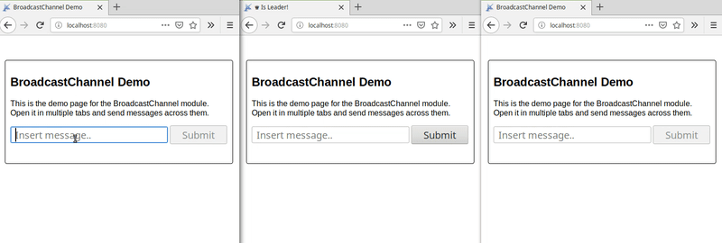

<!--
    This is a different REDME file which will be published to npm
    The one for GitHub is in .github directory.

    @link https://stackoverflow.com/a/65676410/3443137

    The problem was that google indexed the npm-site instead of the github site
-->

  

<h1 align="center">BroadcastChannel</h1>

  <strong>A BroadcastChannel that works in old browsers, new browsers, WebWorkers and NodeJs and Deno</strong>
   
  + LeaderElection over the channels

    

* * *

A BroadcastChannel that allows you to send data between different browser-tabs or nodejs-processes.
And a LeaderElection over the channels.

# [Read the full documentation on github](https://github.com/pubkey/broadcast-channel)

# Sponsored by

    <a href="https://rxdb.info/?utm_source=github&utm_medium=repo&utm_campaign=github-broadcast-channel-npm">
        
          
          
         The <b>JavaScript Database</b>
    </a>

